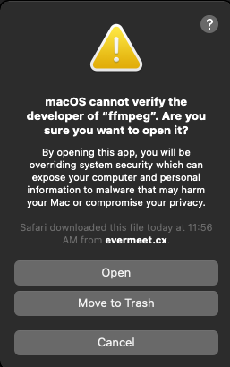
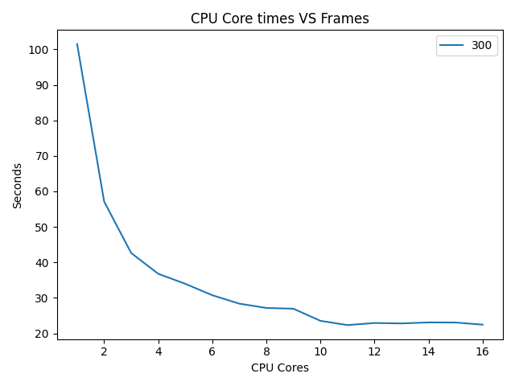

# 03 Prove: Video Frame Processing

## Overview

Processing videos can take a great deal of processing time and resources.  You will be combining two videos together where one video will contain a "green screen".  The results of your assignment will be a new combined video.  The goal of the assignment is to use all of the CPU cores on your computer for the video processing.


## Project Description

### Software Required for the Assignment

**Pillow**

The Python package `pillow` needs to be installed for this assignment.  Follow the same steps when you installed `numpy` and `matplotlib`.

**FFmpeg**

FFmpeg is a free open-course video and image converter.  It is included in the github files for the assignment.  Read below to install it on Windows or Mac.

#### Windows Installation

1. Download `ffmpeg.exe` from the assignment folder in github.
2. Place that exe in the same folder as your other assignment files.

#### MAC Installation

1. Download `mac-ffmpeg-4.3.1.7z` from the assignment folder in github.
2. Place that it in the same folder as your other assignment files.
3. Double click on the `7z` file to un-compress it.  It will create a `ffmpeg` app.  Make sure that this app is in the same folder as your assignment code.

Note, I downloaded VLC Player in order to view the final.mp4 video file that is created.

When you have everything in place and try running the `setup_files_dirs.py` program, MAC OS might the following warning message:


Click on `cancel` and go to the `Security & Privacy` options in the settings app.


Click on the "Allow Anyway" button.  Then close this window and return to the Python program.  When you run it, might still get this warning message.  Click on `open` to continue.



### Assignment Files

**`setup_files_dirs.py`**

After you download the assignment files from GitHub, run this program to create the sub-folders required for the assignment.  It will also decode the two mp4 files and create individual frame images and place them in the created sub-folders.

You must have the program `ffmpeg` in the same folder as this program.

**`assignment.py`**

This is the assignment file that you will write your program. Look for the `TODO` in comments.  The code in the main function will create a plot of the number of frames that you process and their times.

**`elephants.mp4`**

Short video of elephants.

**`green.mp4`**

Short video of a TV with the screen all green.

**`create_final_video.py`**

Once you have created all of the frames in the `processed` folder, run this program.  It will create a video based on the images found in `processed`.  The video that is created will be called `final.mp4`.  You are not submitting this final video file, only your Python code.

### Directory Structure

After you run `setup_files_dirs.py`, you will have the following directory structure.  (There is sample code in `assignment.py` that uses these folders)

```text
assignment
  |- elephant (Contains elephant frames)
  |- green (Contains green screen frames)
  |- processed (Contains you processed frame images that you create)
```

## Assignment

Take a look at the code in `assignment.py` and the `TODO` in the comments.  Your goal is to process all 300 frames from the `elephant` and `green` folders to create 300 new frames in the `processed` folder.

Your program will process all of the frames using 1 CPU core.  You will need to keep track of the time it took to process all of the frames.  (See the main code for the variables that will be used.)

Then, you will process all of the frames using 2 CPU cores and record to the time it took.  Then 3 CPU cores, 4 CPU cores, etc... until you reach `CPU_COUNT` CPU cores.

On my computer, I have 12 CPU cores.  The const variable `CPU_COUNT` is set to 4 more the number of CPU cores on your computer.  So for me CPU_COUNT equals 16.  Here is a example of the plot that is created for 16 CPU cores.  Notice that the processing time decreases with more CPU cores.  Your results might/should be different on your computer.



## Rubric

Assignments are not accepted late. Instead, you should submit what you have completed by the due date for partial credit.
The Assignment will be graded in broad categories according to the following:

| Grade | Description |
|-------|-------------|
| 0% | Nothing submitted |
| 50% | Some attempt made |
| 75% | Developing (but significantly deficient) |
| 85% | Slightly deficient |
| 93% | Meets requirements |
| 100% | Showed creativity and extend your assignments beyond the minimum standard that is specifically required.  Do not use different videos than the ones included in this assignment. |


## Submission

When finished, upload your Python file to Canvas.

